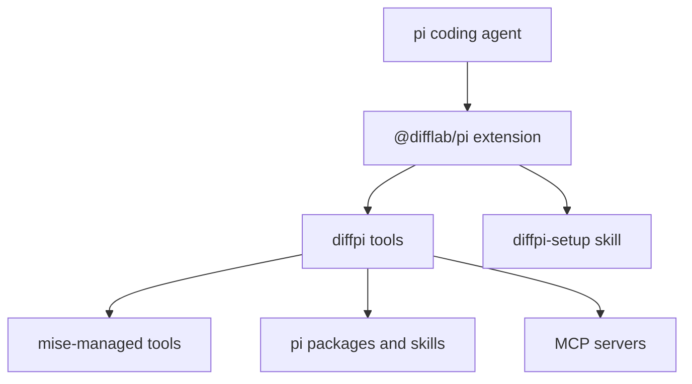

# Architecture

## Overview

`@difflab/pi` is a package for the pi coding agent. It supplies setup tools and a guided setup skill through one extension.

## Public surface

- [`Setup`](setup.md) documents the `diffpi_validate`, `diffpi_setup`, and `diffpi_reload` tool contracts.
- The bundled `diffpi-setup` skill collects user choices and coordinates those tools.

## Managed dependencies

mise manages command-line development tools such as Node.js, Zellij, Helix, tuicr, and Context Mode. Setup also manages these dependency groups:

- pi packages and extensions
- maintainer-provided skills
- Model Context Protocol servers
- optional issue-tracker adapters

## Design

The setup workflow is idempotent. Validation reports planned actions without mutation. Setup preserves unrelated configuration and requires approval before installation.

## References

- [pi packages](https://pi.dev/docs/packages)
- [pi extensions](https://pi.dev/docs/extensions)
- [mise](https://mise.jdx.dev/)
