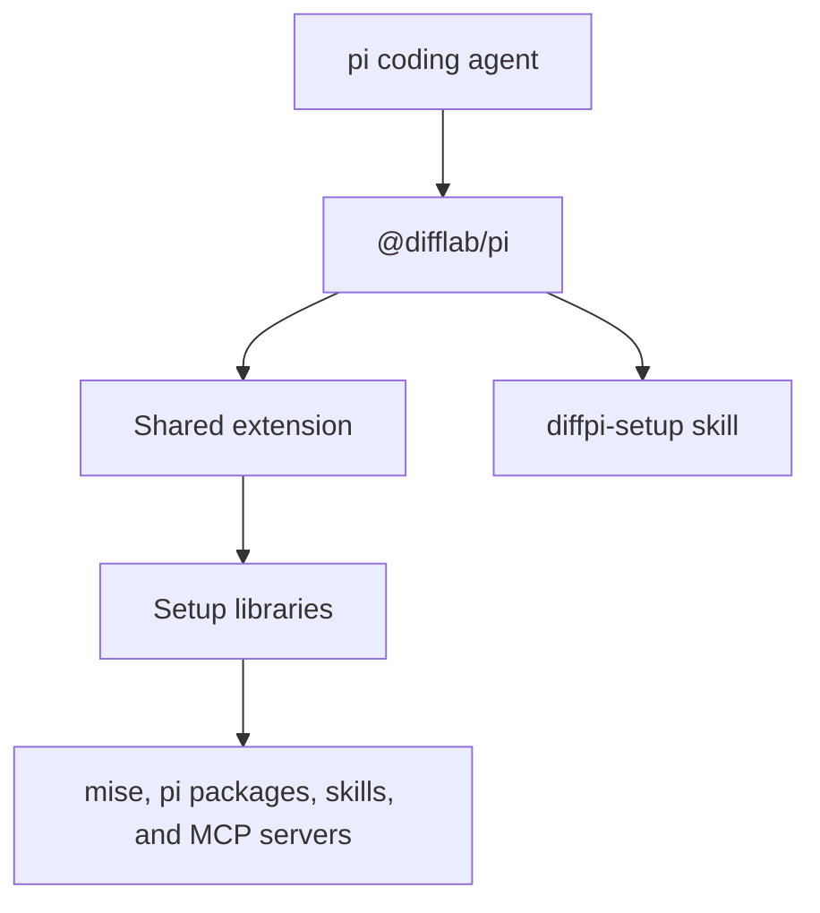
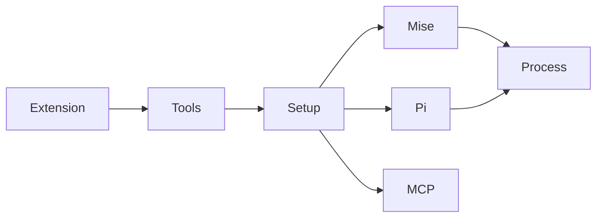

# Architecture

## Overview

`@difflab/pi` is a package for the pi coding agent. It supplies one extension, setup tools, and a setup skill. It does not replace pi or the packages that it installs.

### Technology Stack

| Layer        | Choice             | Notes                                                          |
| ------------ | ------------------ | -------------------------------------------------------------- |
| Runtime      | Node.js 22 and Bun | Runs setup code and package tasks                              |
| Agent host   | pi                 | Loads the extension and skill manifest                         |
| Tool manager | mise               | Installs global command-line dependencies                      |
| MCP client   | pi-mcp-adapter     | Loads Model Context Protocol servers from shared configuration |

### Repository Structure

```
diffpi/
├── packages/pi/            # Published @difflab/pi package
├── docs/architecture/      # Architecture index and library docs
├── .github/workflows/      # Test and release pipelines
└── mise.toml               # Repository task and tool configuration
```

## Design

### Components



- [`Libraries`](libs/index.md) — exposes setup, mise, pi, and Model Context Protocol configuration APIs.
- GitHub Actions calls package tasks from `packages/pi/mise.toml`.

## Implementation

### Dependency Graph



### Extension loading

The package manifest loads `dist/extensions/index.js`. The extension registers the shared tool catalog and adds documentation-routing guidance before each agent turn.

### Setup orchestration

The setup module checks each requirement in order. The mise, pi, and Model Context Protocol modules own their command and configuration operations.

## References

- [pi packages](https://pi.dev/docs/packages) — package manifest behavior
- [mise](https://mise.jdx.dev/) — tool management and Model Context Protocol server
- [pi-mcp-adapter](https://github.com/nicobailon/pi-mcp-adapter) — shared Model Context Protocol configuration
- `packages/pi/package.json` — package manifest
