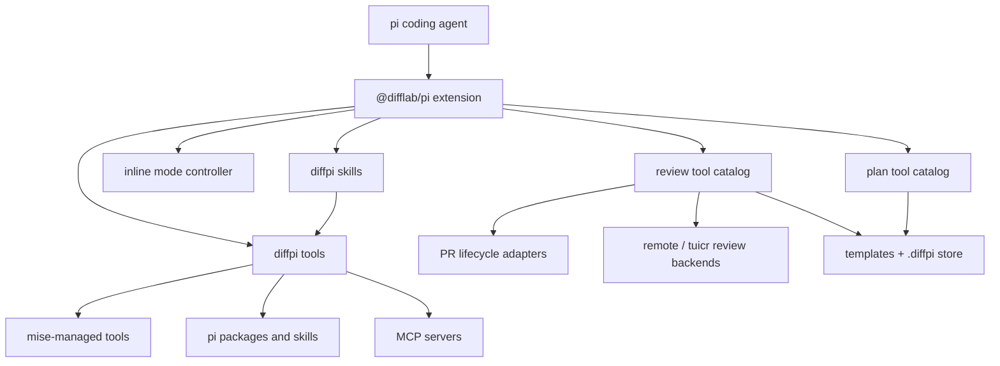

# Architecture

## Overview

`@difflab/pi` is a package for the pi coding agent. One extension supplies setup tools, inline mode tools, and guided skills.

## Public surface

- [`Setup`](setup.md) documents environment installation and the setup tool contracts.
- [`Inline modes`](modes.md) documents shared agents, mode tools, session behavior, and the `mode` skill.
- [`Review`](review.md) documents `/review`, forge lifecycle adapters, local and remote review backends, templates, shared storage, provenance, publication, and merge boundaries.
- [`Planning`](plan.md) documents `/plan`, editable plan records, annotations, locks, execution, gates, commits, and escalation.
- [`Environment`](environment.md) documents environment detection and the observable `tuicr` launch fallbacks.
- The bundled skills route setup, mode, and review requests to focused tools.

## Managed dependencies

mise manages command-line development tools such as Node.js, Zellij, Helix, tuicr, and Context Mode. Setup also manages these dependency groups:

- pi packages and extensions
- maintainer-provided skills
- Model Context Protocol servers
- optional issue-tracker adapters

## Design

The setup workflow is idempotent. Validation reports planned actions without mutation. Setup preserves unrelated configuration and requires approval before installation. The mode skill routes user input to the mode tools, while the extension applies and restores selected prompts.

## References

- [pi packages](https://pi.dev/docs/packages)
- [pi extensions](https://pi.dev/docs/extensions)
- [mise](https://mise.jdx.dev/)
