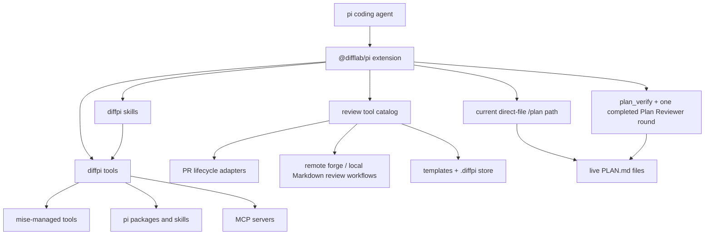

# Architecture

## Overview

`@difflab/pi` is a package for the pi coding agent. One extension supplies setup, plan verification, review, logging, template, reload, and CI tools; the package manifest supplies guided skills.

## Public surface

- [`Setup`](setup.md) documents environment installation and the setup tool contracts.
- [`Review`](review.md) documents `/review`, forge lifecycle adapters, local and remote review backends, templates, shared storage, provenance, publication, and merge boundaries.
- [`Planning`](plan.md) documents live `/plan` files, `plan_verify`, one completed Plan Reviewer round per authoring cycle, execution gates, and escalation.
- [`Evaluations`](evaluations.md) documents Promptfoo test cases, isolated plan generation, read-only judging, artifacts, and mise commands.
- [`Environment`](environment.md) documents environment detection and direct-file or forge URL fallbacks.
- Bundled plan and review skills route substantive work to attached background subagents with ambient capabilities.

## Managed dependencies

mise manages command-line development tools such as Node.js, Zellij, Helix, and Context Mode. Setup also manages these dependency groups:

- pi packages and extensions
- maintainer-provided skills
- Model Context Protocol servers
- optional issue-tracker adapters

## Design

```mermaid
graph TD
    Pi["pi coding agent"] --> Extension["@difflab/pi extension"]
    Extension --> Tools["diffpi tools"]
    Extension --> Skills["diffpi skills"]
    Extension --> Review["review tool catalog"]
    Extension --> PlanCurrent["current direct-file /plan path"]
    Extension --> PlanTarget["plan_verify + one completed Plan Reviewer round"]
    Skills --> Tools
    Review --> Forge["PR lifecycle adapters"]
    Review --> Backends["remote forge / local Markdown review workflows"]
    Review --> Store["templates + .diffpi store"]
    PlanCurrent --> Files["live PLAN.md files"]
    PlanTarget --> Files
    Tools --> Mise["mise-managed tools"]
    Tools --> Packages["pi packages and skills"]
    Tools --> MCP["MCP servers"]
```

The setup workflow is idempotent. Validation reports planned actions without mutation. Setup preserves unrelated configuration and requires approval before installation. Old session entries from removed profile selection are ignored; no tool snapshot is restored. A host that fails to expose a registered tool must be reported separately.

## References

- [pi packages](https://pi.dev/docs/packages)
- [pi extensions](https://pi.dev/docs/extensions)
- [mise](https://mise.jdx.dev/)
