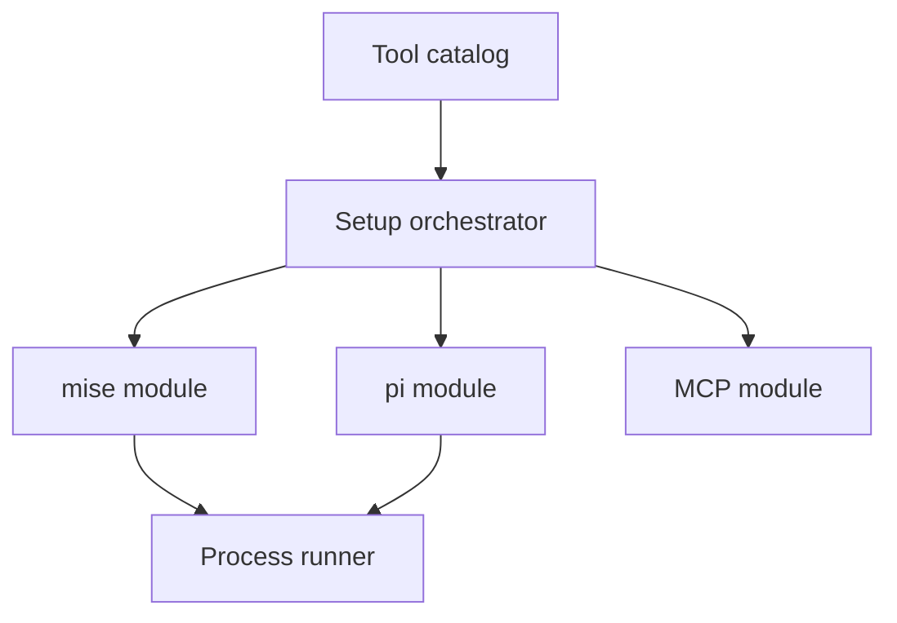

---
globs:
  - 'packages/pi/**'
---

# @difflab/pi Library

## Overview

This library configures a pi coding environment. The package extension imports its public tool catalog. The library hides command execution and configuration-file details from the extension.

## Requirements

### Functional

- The library must report missing requirements without changing the machine.
- The library must install missing global tools, pi packages, upstream skills, and Model Context Protocol servers.
- Repeated setup runs must not duplicate configuration.

### Non-Functional

- Setup operations must use upstream configuration types when they are available.
- Public tools must use the `diffpi_` prefix.
- Setup must preserve unrelated user configuration.

## Design

### Components



- `setup` — coordinates checks and installations.
- `mise` — manages global and local mise tools and shell hooks.
- `pi` — manages pi packages, global skills, and pi settings.
- `mcp` — merges server entries with the pi-mcp-adapter configuration schema.

### Usage

#### Validate setup

```typescript
import { setupPi } from '@difflab/pi';

const result = await setupPi({ dryRun: true });
```

### API

#### Data Model

`SetupResult` contains each setup action and states whether pi must restart.

#### Functions/Classes

- `setupPi` runs the complete setup sequence.
- `ensureMise`, `ensureMiseHooks`, and `ensureMiseDeps` manage mise.
- `ensurePiPlugins` and `ensurePiSkills` manage pi resources.
- `ensureMcpAdapters` manages Model Context Protocol configuration.
- `mise`, `pi`, and `mcp` expose focused lower-level operations.

#### Configuration

`SetupOptions` accepts dry-run mode, optional Linear or Jira setup, and path overrides for testing or custom installations.

## Implementation

### Modules/Objects

`src/tools/index.ts` exports the tool catalog. `src/tools/setup.ts` defines the setup and validation tools. `src/setup.ts` coordinates the three focused modules. `src/process.ts` bounds command output and reports failed commands.

## References

- `packages/pi/src/index.ts` — public API entry point
- `packages/pi/src/setup.ts` — setup orchestration
- [pi extension API](https://pi.dev/docs/extensions) — extension registration contract
- [pi-mcp-adapter types](https://github.com/nicobailon/pi-mcp-adapter/blob/main/types.ts) — Model Context Protocol configuration schema
