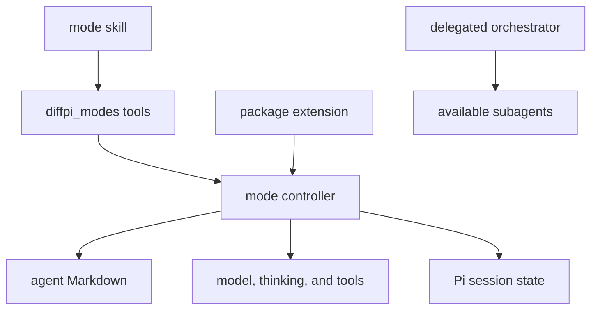

# Agent profiles and inline modes

## Overview

Diffpi ships six shared agent profiles: `tutor`, `copilot`, `worker`, `planner`, `reviewer`, and `orchestrator`. The profiles are normal Markdown agent definitions for `@tintinweb/pi-subagents`. Each profile can run inline when its frontmatter permits it. Simple background plan and review commands spawn one named Planner or Orchestrator through the `extensions/subagentx.ts` adapter for pi-subagents RPC v2 and preserve the foreground mode; they do not recursively launch Pi or route through `/bg --agent`. Further delegation uses `Agent`, `get_subagent_result`, and `steer_subagent`. The active Orchestrator invokes `SubagentWorkflow` for deterministic multi-stage orchestration because workflow children cannot be launched or controlled over the extension RPC bus. pi-background-tasks remains available for ordinary long-running shell commands, tests, builds, and servers.

An inline mode applies the selected profile's prompt, first available preferred model, thinking level, and available tool set. Clearing the mode restores the model, thinking level, tools, and prompt that were active before selection.

## Requirements

### Functional

- The mode skill must list, select, clear, and explain inline modes.
- Standard discovery must exclude skill-owned agents unless the user requests them.
- A qualified `skill:agent` id must enable skill-agent discovery during direct selection.
- Selection must store the complete profile and previous runtime state in branch-aware session state.
- Model selection must try the profile's preferences in order and keep the current model when none are available.
- Tool selection must keep the mode-control tools available so the user can switch or clear a mode.
- Orchestrator must remain delegated-only and may route work to any available subagent.

### Non-functional

- Project discovery must require project trust.
- Status updates must not replace the shared footer.
- Public mode tool names must use the `diffpi_` prefix.
- Setup must not ask the user to configure model choices.
- Mode selection must fail safely when optional models or tools are unavailable.

## Design

### Components



- The `mode` skill routes command arguments and structured picker answers to the public tools.
- The controller discovers profiles, stores the selected snapshot and baseline runtime, applies the profile, and publishes status.
- Agent Markdown files define the same behavior for inline mode and delegated runs.
- `inline: false` excludes a profile from inline discovery without hiding it from the subagent plugin.

### Shared agent policy

| Agent          | Inline | Purpose                                                                | Preferred model route                           | Thinking | Tool policy                                         |
| -------------- | ------ | ---------------------------------------------------------------------- | ----------------------------------------------- | -------- | --------------------------------------------------- |
| `tutor`        | Yes    | Progressive teaching with verified docs, links, snippets, and examples | Sol, then Fable                                 | Medium   | Read-only code, docs, and focused web research      |
| `copilot`      | Yes    | Tandem editing with fast lookups and small implementation steps        | Luna, then Haiku, Qwen Flash, or DeepSeek Flash | Low      | Read, edit, commands, docs, and focused web lookup  |
| `worker`       | Yes    | Execute bounded source changes and report plan progress                | Luna, then Haiku, Qwen Flash, or DeepSeek Flash | Low      | Source tools and plan execution tools               |
| `planner`      | Yes    | Author and revise plans without source changes                         | Sol, then Opus, DeepSeek Pro, or Qwen Pro       | High     | Read tools and plan authoring tools                 |
| `reviewer`     | Yes    | Judge changes and coordinate review fixes                              | Sol, then Opus, DeepSeek Pro, or Qwen Pro       | High     | Review tools and bounded Worker delegation          |
| `orchestrator` | Yes    | Schedule background agents and coordinate plan or review work          | Luna, then Haiku, Qwen Flash, or DeepSeek Flash | Medium   | Subagent routing and coordinator-owned phase commit |

The model names are provider catalog ids, not package dependencies. See the provider model references for [OpenAI](https://platform.openai.com/docs/models), [Anthropic](https://docs.anthropic.com/en/docs/about-claude/models/overview), [Qwen](https://qwenlm.github.io/), and [DeepSeek](https://api-docs.deepseek.com/). The singular `model` field is official `@tintinweb/pi-subagents` frontmatter. Ordered fallback frontmatter is not supported by that plugin. `model_fallbacks` is a Diffpi field: inline mode consumes the full list, and setup resolves the first currently available preference into the official `model` field of each installed delegated agent.

Orchestrator uses background delegation by default. It builds a dependency graph, runs independent tasks in parallel, collects results, and retries transient failures. For plan work, it owns phase order, gates, and optional phase commits. It routes blocked work to Planner and stops when a user decision is required. It does not edit files itself.

### User model configuration

Users can replace any agent's preference order in `~/.difflab/diffpi/config.yaml` or, when YAML is absent, `~/.difflab/diffpi/config.json`.

```yaml
agents:
  orchestrator:
    models:
      - openai-codex/gpt-5.6-sol
      - meridian/claude-opus-4-8
      - meridian/claude-opus-5
      - deepseek/deepseek-v4-pro
      - qwen-token-plan/qwen3.7-plus
```

A user list replaces the bundled order. An explicit empty list disables automatic model selection for that agent. YAML takes precedence over JSON when both exist. A malformed higher-precedence file reports its path and does not silently fall through.

Inline discovery reads the configuration directly. Run `/skill:diffpi-setup` after changing it to rematerialize delegated agent files, then reload Pi when setup requests it. Setup uses Pi's authenticated model catalog to write the first available preference to the plugin's official singular `model` field. When none are available, setup omits `model` so the delegated agent inherits the parent model.

### API

#### `diffpi_modes_list`

Discovers standard inline agents. Set `includeSkills` to true to include skill-owned agents with `skill:agent` ids. Delegated-only profiles are omitted.

#### `diffpi_modes_set`

Validates an agent id and applies its complete runtime profile. The changes start on the next model turn.

#### `diffpi_modes_unset`

Clears the selected agent and restores the previous model, thinking level, tools, and default prompt.

#### `/skill:mode`

Calls the mode tools. With no arguments, the skill uses `ask_user_question` to show a structured picker.

```text
/skill:mode help
/skill:mode --include-skills
/skill:mode tutor
/skill:mode spec:planner
/skill:mode clear
```

## Implementation

### Discovery

Standard discovery reads bundled agents, global Pi agents, trusted `.agents/agents/` files, and trusted `.pi/agents/` files in that order. Later sources replace earlier agents with the same id. Files with `enabled: false` or `inline: false` are excluded.

Optional skill discovery reads global and trusted project `agents/*.md` files below skill directories. The controller qualifies each result as `skill:agent`.

### Runtime routing

The controller reads these frontmatter fields:

- `prompt_mode`: `replace` or `append`.
- `model`: the primary provider/model reference.
- `model_fallbacks`: comma-separated fallback references.
- `thinking`: Pi's thinking level.
- `tools`: comma-separated tool names.

Model matching prefers an exact provider/model reference, then the same model id under another provider, then a token match. Unavailable preferences are skipped. Tools are filtered against the current tool registry. The four mode-control tools remain active even when a profile restricts tools.

Before the first mode selection, the controller snapshots the current model, thinking level, and active tools. It stores that baseline with the selected profile in branch-aware session state. Reload, resume, fork, and tree navigation reapply the selected profile. Clearing the mode or navigating to a branch without it restores the baseline.

### Prompt behavior

Replace mode uses only the agent body. Append mode keeps the normal Pi and Diffpi prompt before the agent body. The status key `diffpi-mode` shows `mode: <id>` without replacing the shared footer.

Inline mode is not a security boundary. It changes the active tool list but does not implement permission enforcement, isolation, or a separate conversation. Prior messages remain in context, and later extensions can modify the effective prompt. Use a delegated subagent when work needs isolation or nested delegation.

## References

- [Pi skills](https://pi.dev/docs/skills)
- [Pi extensions](https://pi.dev/docs/extensions)
- [Pi models](https://pi.dev/docs/models)
- [`@tintinweb/pi-subagents`](https://github.com/tintinweb/pi-subagents)
