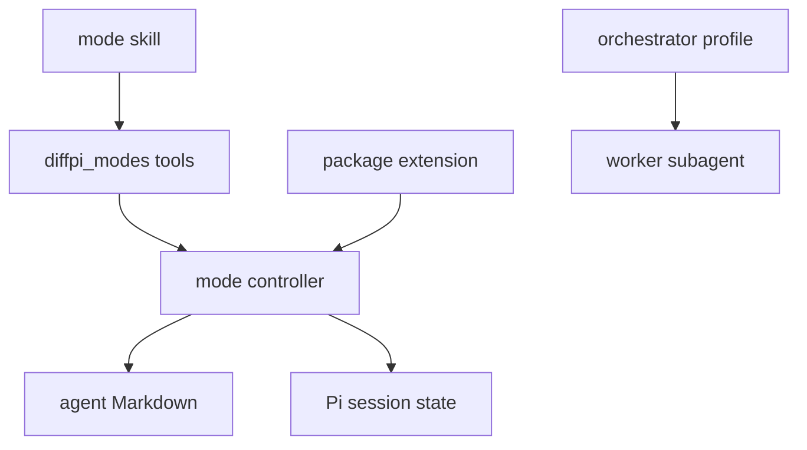

---
globs:
  - 'packages/pi/agents/**'
  - 'packages/pi/skills/mode/**'
  - 'packages/pi/src/modes.ts'
  - 'packages/pi/src/tools/modes.ts'
  - 'packages/pi/extensions/index.ts'
  - 'packages/pi/tests/modes.test.ts'
---

# Inline modes

## Overview

An inline mode is an agent prompt that runs in the current conversation. The mode system owns profile discovery, selection, session state, and prompt composition. It does not change the current model, tools, or permission policy.

## Requirements

### Functional

- The mode skill must list, select, clear, and explain inline modes.
- Standard discovery must exclude skill-owned agents unless the user requests them.
- A qualified `skill:agent` id must enable skill-agent discovery during direct selection.
- Selection must store the complete prompt snapshot in branch-aware session state.
- The orchestrator must delegate bounded implementation work only to worker agents.

### Non-Functional

- Project discovery must require project trust.
- Inline selection must not enforce delegated model or tool fields.
- Status updates must not replace the shared footer.
- Public mode tool names must use the `diffpi_` prefix.
- Bundled profiles must work across providers without a required model selection during setup.

## Design

### Components



- The `mode` skill routes command arguments and structured picker answers to the public tools.
- The mode tools expose list, set, and clear operations to the model.
- The controller discovers profiles, stores the selected snapshot, applies the prompt, and publishes status.
- Agent Markdown files define behavior for inline mode and delegated `@tintinweb/pi-subagents` runs.

### Shared agent policy

| Agent          | Delegated tool policy                           | Delegated model policy   |
| -------------- | ----------------------------------------------- | ------------------------ |
| `tutor`        | Read-only tools                                 | Inherit the parent model |
| `planner`      | Read-only tools                                 | Inherit the parent model |
| `copilot`      | Inherit the parent tools                        | Inherit the parent model |
| `worker`       | Inherit the parent tools                        | Inherit the parent model |
| `orchestrator` | Inherit parent tools and allow worker subagents | Inherit the parent model |

Diffpi omits `model` from bundled frontmatter because model catalogs depend on the installed providers. You can override a profile through the `@tintinweb/pi-subagents` `/agents` interface or a higher-precedence project agent file. Inline mode ignores delegated model and tool fields.

The orchestrator sets `allowed_subagents: worker`. This runtime allowlist gives a delegated orchestrator ownership-scoped subagent tools and prevents it from spawning other agent types.

### API

#### `diffpi_modes_list`

Discovers standard inline agents. Set `includeSkills` to true to include skill-owned agents with `skill:agent` ids.

#### `diffpi_modes_set`

Validates an agent id and stores its prompt in the session. The selected prompt starts on the next turn.

#### `diffpi_modes_unset`

Clears the stored agent and restores the default Pi prompt on the next turn.

#### `/skill:mode`

Calls the mode tools. With no arguments, the skill uses `ask_user_question` to show a structured picker.

```text
/skill:mode help
/skill:mode --include-skills
/skill:mode tutor
/skill:mode spec:planner
/skill:mode clear
```

## Implementation

### Discovery

Standard discovery reads bundled agents, global Pi agents, trusted `.agents/agents/` files, and trusted `.pi/agents/` files in that order. Later sources replace earlier agents with the same id.

Optional skill discovery reads global and trusted project `agents/*.md` files below skill directories. The controller qualifies each result as `skill:agent`.

### Skill routing

The `mode` skill handles `help`, direct ids, `clear`, and `--include-skills`. The extension does not parse mode arguments. Picker requests call `diffpi_modes_list`, ask one structured question, and pass the answer to a set or clear tool.

### Prompt and session behavior

Agent frontmatter can set `prompt_mode` to `replace` or `append`. Replace mode uses only the agent body. Append mode keeps the normal Pi and Diffpi prompt before the agent body.

The controller stores the selected prompt in branch-aware session state. It restores the snapshot after reload, resume, fork, and tree navigation. The status key `diffpi-mode` shows `mode: <id>` without replacing the shared footer.

Inline mode is not a security boundary. Prior messages and provider-visible tools remain available. Use a delegated subagent when a task needs a separate session or full agent frontmatter enforcement.

## References

- [Pi skills](https://pi.dev/docs/skills)
- [Pi extensions](https://pi.dev/docs/extensions)
- [`@tintinweb/pi-subagents`](https://github.com/tintinweb/pi-subagents)
