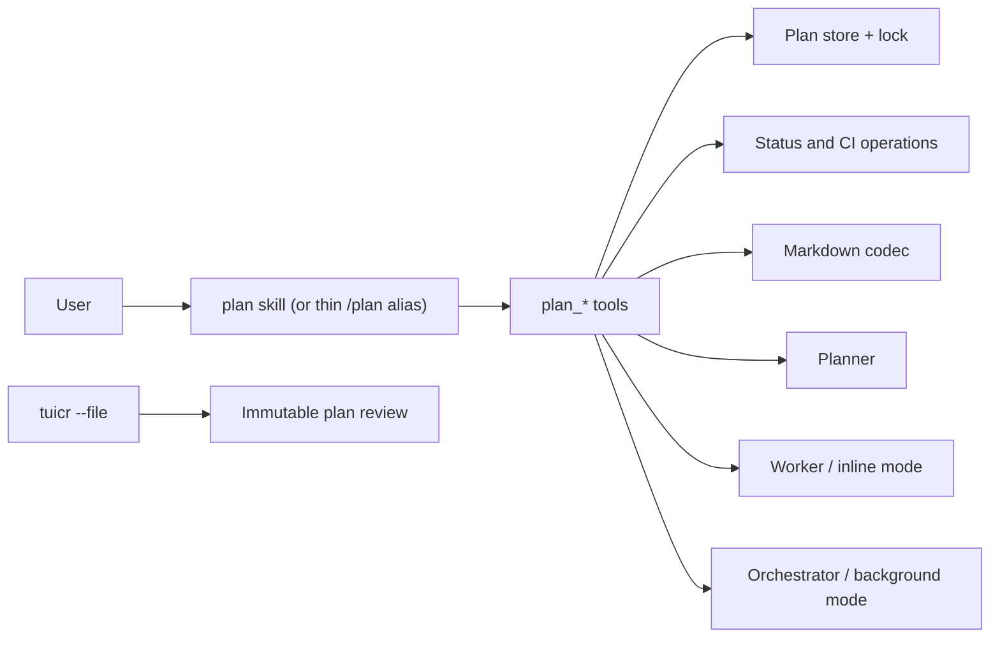

# Planning

## Overview

The planning system stores editable implementation plans in a shared repository store. A plan records intent, design, ordered work, progress, gates, commits, and blockers. Planner authors the plan. Worker implements inline work. Orchestrator coordinates background work.

## Requirements

- Plans use `.diffpi/plan/<YYMMDD[-ticket]-short-slug>/PLAN.md`, `implementation/phase-<ordinal>.md`, immutable `revisions/<n>/` snapshots, and execution events in `logs.txt`.
- `PLAN.md` contains Intent, Requirements, Design, ordered phases, concise task checkboxes, and References. Detailed ordered steps, file scopes, API/data contracts, algorithms, constraints, and acceptance criteria belong in numbered phase briefs.
- Design contains outcome-oriented Big Ideas bullets, illustrated Key API Addition/Updates, and before/after Consequences.
- Stable HTML markers store revisions, IDs, status, ownership, gates, and commit data.
- Users may edit prose but must preserve markers and unique lowercase IDs.
- Plan review uses `tuicr --file`; `-p` and `--path` are VCS-diff filters.
- Closing tuicr stores one immutable review dump for the reviewed plan revision. Reviews have no reply or resolution state.
- Background authoring uses pi-subagents in-process RPC with inherited context and a named Planner; it does not create packets or recursive Pi processes.

## Design

The plan workflow exposes one durable document API and two execution paths:

The plan module has no controller facade. `PlanStore` owns file access and locked mutations. Plain operations apply status and CI transitions. The plan tools call the store, operations, Markdown codec, and plan-review adapter directly.

### Storage

The repository `.diffpi` symlink points to the global store at `~/.difflab/diffpi/projects/<repository-id>/`. All worktrees for one repository share records. Every content-authoring request stores one immutable `revisions/<n>/` directory with the exact input, metadata, complete `PLAN.md`, and all numbered briefs. The root files are the latest view. `logs.txt` contains execution events without creating content revisions. An explicit tuicr plan review is stored separately at `reviews/<revision>.json`.

### Mutations and locks

A plan mutation creates a temporary lock directory because all worktrees share the same `.diffpi` store. The mutation reads the latest plan, checks the expected revision or status, writes a temporary file, renames it, and removes the lock. Logs append directly, and plan reviews use write-once files without the mutation lock. Gate results are rejected when the phase changes while a gate command runs.

### Tools and workflows

`plan_init` creates a phase-less draft; `plan_apply_revision` commits one complete candidate with exact typed inputs and complete numbered briefs. It is the sole content-authoring mutation. Execution tools are `plan_log_progress`, `plan_update_status`, `plan_run_gates`, `plan_record_ci`, and `plan_start_execution`. The generic `watch_ci` tool observes hosted CI without changing plan state. Review tools are `plan_annotate` and `plan_review`. Strict `plan_validate` checks markers, dependencies, brief completeness and parity, snapshot consistency, and Design shape; it does not verify source implementation. The separate `diffpi_log` tool provides project-scoped progress, issue, and deviation channels for non-plan workflows such as flows; it is an activity log, not another task system.

The `/plan` command is a thin alias owned by the `plan` skill. The skill references define init, new, update, annotate, finalize, go, and help; they call the durable `plan_*` tools directly. `init` creates one phase-less revision and opens that revision for editing; `new` creates one complete revision without opening an editor. Explicit non-opening paths are retained for automation and tests. Agent prompts identify Planner, Orchestrator, and Worker ownership, while plan tools remain the durable source of truth. `/review` follows the same thin-alias model, with review workflows owned by the `review` skill.

### Execution and recovery

A phase completes only after its tasks finish, format check/lint/test gates pass or are explicitly skipped, and an optional coordinator commit is recorded. Commit and push modes require a clean worktree. Commit mode creates local commits only; push mode pushes each phase commit and records pending CI. A bounded background Worker runs `watch_ci` for the exact pushed SHA and records the result with `plan_record_ci` while the next phase executes. The coordinator collects it before the next push; plan completion requires every phase CI result to pass or be explicitly skipped because no supported forge or commit checks exist. A crash after Git creates or pushes a commit but before the plan records its SHA is recoverable by comparing `HEAD`, its upstream, and `logs.txt`.

Worker stores blockers, attempts, and evidence in the plan. Orchestrator collects delegated Worker results and treats plan, phase, and task identifiers as correlation metadata. Background execution can ask Planner to revise pending or blocked work at most twice per task. Background agents never ask users questions; human decisions return to the main thread.

## Implementation

The package exposes the `plan_*` tools, Planner agent, plan skill, `/plan` command, review dump adapter, and `diffpi` CLI. The CLI and extension share plan resolution and immutable tuicr review storage. Review and planning share the pi-subagents RPC adapter for named coordinators. Local code reviews use independent immutable tuicr revision dumps; remote code reviews keep their state on GitHub or GitLab.

## References

- [User guide](../user-guide.md#plan-work)
- [`src/plan/`](../../packages/pi/src/plan/)
- [`src/plan/operations.ts`](../../packages/pi/src/plan/operations.ts)
- [`src/tools/plan.ts`](../../packages/pi/src/tools/plan.ts)
- [`src/commands/plan.ts`](../../packages/pi/src/commands/plan.ts)
- [`src/plan/markdown.ts`](../../packages/pi/src/plan/markdown.ts)
- [`src/extensions/subagentx.ts`](../../packages/pi/src/extensions/subagentx.ts)
- [`src/extensions/tuicrx.ts`](../../packages/pi/src/extensions/tuicrx.ts)
- [Review architecture](review.md)
