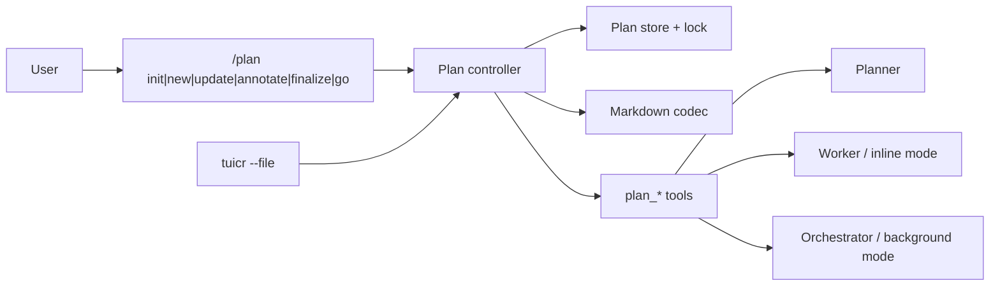

# Planning

## Overview

The planning system stores editable implementation plans in a shared repository store. A plan records intent, design, ordered work, progress, gates, commits, and blockers. Planner authors the plan. Worker implements inline work. Orchestrator coordinates background work.

## Requirements

- Plans use `.diffpi/plan/<YYMMDD[-ticket]-short-slug>/PLAN.md` and `logs.txt`.
- `PLAN.md` contains Intent, Requirements, Design, Implementation, and References.
- Design contains Big Ideas, Key API Addition/Updates, and Consequences.
- Stable HTML markers store revisions, IDs, status, ownership, gates, and commit data.
- Users may edit prose but must preserve markers and unique lowercase IDs.
- Annotation uses `tuicr --file`; `-p` and `--path` are VCS-diff filters.
- Background authoring uses pi-subagents in-process RPC with inherited context and a named Planner; it does not create packets or recursive Pi processes.

## Design

The plan workflow exposes one durable document API and two execution paths:

The public plan API is the controller facade. It exposes `create`, `read`, `update`, `updateStatus`, and `appendLog` operations rather than storage callbacks or transition assertions. It resolves a plan, performs locked mutations, validates and applies transitions, renders the Markdown source, records logs, and delegates execution through plan tools and the pi-subagents RPC adapter. Commands and tools use this facade instead of coordinating storage, Markdown, and transition modules themselves.

### Storage

The repository `.diffpi` symlink points to the global store at `~/.difflab/diffpi/projects/<repository-id>/`. All worktrees for one repository use the same records. `logs.txt` is append-only JSON Lines. `annotations.json` appears after the first annotation session and stores the tuicr session slug and applied comment IDs.

### Mutations and locks

A short mutation creates a lock directory inside the plan record. Worktrees do not remove this need because every worktree for a repository points to the same `.diffpi` store, and several agents can update one plan concurrently. The mutation reads the latest plan, checks the expected revision or status, writes a temporary file, flushes it, and renames it. A timeout reports lock ownership. The system does not remove a stale lock without user action. Tests, formatters, linters, tuicr, and Git run without a plan lock. Gate results are rejected when the phase changes while a gate command runs.

### Tools and workflows

Authoring tools are `plan_init`, `plan_update_overview`, `plan_add_phase`, `plan_remove_phase`, and `plan_update_phase`. Execution tools are `plan_log_progress`, `plan_update_status`, `plan_run_gates`, and `plan_start_execution`. Annotation tools are `plan_annotate`, `plan_annotations`, and `plan_ack_annotations`. `plan_validate` checks markers, dependencies, cycles, required work, acceptance criteria, annotations, and Design length. The separate `diffpi_log` tool provides project-scoped progress, issue, and deviation channels for non-plan workflows such as flows; it is an activity log, not another task system.

The `/plan` workflow supports init, new, update, annotate, finalize, and go. Foreground init, new, and update select Planner; annotate, finalize, go, and help select Worker. Deferring implementation during finalize restores the default mode, and a completed inline execution does the same. Background execution launches one named Orchestrator through `src/extensions/subagentx.ts`, the adapter for `@tintinweb/pi-subagents` public RPC v2, and preserves the foreground mode. The already-running Orchestrator passes `coordinator: current` to `plan_start_execution`; normal callers use the default `spawn` disposition. The extension cannot launch workflow children through RPC, so the Orchestrator invokes `SubagentWorkflow` itself for deterministic pipelines, safe parallel workers, structured outcomes, and gates. Plan tools remain the durable source of truth.

### Execution and recovery

A phase completes only after its tasks finish, format check/lint/test gates pass or are explicitly skipped, and an optional coordinator commit is recorded. Commit mode requires a clean worktree, pushes every phase commit, and records pending CI on the phase. A bounded background Worker runs `plan_watch_ci` for the exact SHA while the next phase executes. The coordinator collects it before the next push; plan completion requires every phase CI result to pass or be explicitly skipped because no supported forge or commit checks exist. A crash after Git creates or pushes a commit but before the plan records its SHA is recoverable by comparing `HEAD`, its upstream, and `logs.txt`.

Worker stores blockers, attempts, and evidence in the plan. Worker-to-orchestrator escalation uses the generic `subagentx` correlation contract; plan, phase, and task identifiers are metadata rather than a plan-only transport. Background execution can ask Planner to revise pending or blocked work at most twice per task. Background agents never ask users questions; human decisions return to the main thread.

## Implementation

The package exposes the `plan_*` tools, Planner agent, plan skill, `/plan` command, annotation adapter, and `diffpi` CLI. The CLI and extension share plan resolution and tuicr session handling. Review and planning share the pi-subagents RPC adapter for named coordinators. Review publication promotes local tuicr drafts to forge review comments before submission, including drafts made in a remote PR session opened by `/review edit`.

## References

- [User guide](../user-guide.md#plan-work)
- [`src/plan/`](../../packages/pi/src/plan/)
- [`src/plan/controller.ts`](../../packages/pi/src/plan/controller.ts)
- [`src/tools/plan.ts`](../../packages/pi/src/tools/plan.ts)
- [`src/commands/plan.ts`](../../packages/pi/src/commands/plan.ts)
- [`src/plan/parser.ts`](../../packages/pi/src/plan/parser.ts)
- [`src/extensions/subagentx.ts`](../../packages/pi/src/extensions/subagentx.ts)
- [`src/extensions/tuicrx.ts`](../../packages/pi/src/extensions/tuicrx.ts)
- [Review architecture](review.md)
