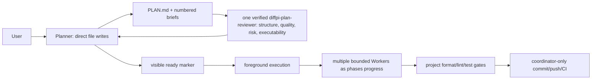

# Planning

## Status of this document

This document describes the shipped direct-file plan workflow. Historical managed plan records remain readable through private helpers and remain unchanged; new workflows do not call them.

## Overview

A plan is a live, human-readable `PLAN.md` plus numbered phase briefs. The Planner writes the authoritative files directly through successive normal read/write/edit calls. Each call is durable, so incomplete files remain visible rather than being hidden in a snapshot or packet.

The live plan keeps the plan and briefs under `.diffpi/plan/<YYMMDD[-ticket]-short-slug>/`. `PLAN.md` contains intent, requirements, design, ordered phases, flat task checkboxes, and references. A phase brief contains the same task IDs, ordered steps, file scopes, acceptance criteria, and one phase-level file tree. File actions use `[ADD]`, `[MODIFY]`, `[REMOVE]`, `[MOVE from: path]`, or `[VERIFY]`; verification is nested under the relevant task. For example:

```text
Phase: persistence
├── [ADD] .diffpi/plan/<slug>/PLAN.md
├── [ADD] .diffpi/plan/<slug>/implementation/phase-1.md
└── [MODIFY] docs/architecture/plan.md
```

- Verify each task by reading back the written files after the task completes.

Libraries and algorithms are listed under Constraints. Prerequisites belong to phases only; tasks form a flat list within each phase.

## Roles and execution tiers

- **Planner** authors and repairs `PLAN.md` and briefs, and answers plan-review findings. It has frontier/high thinking, read/write/edit/file tools, and `Agent` on plan files; policy governs paths, rather than a Pi path sandbox.
- **diffpi-plan-reviewer** is one independent, verified frontier-model, high-thinking, read/search-only reviewer. In one pass it checks structure/parity/action labels, overall plan quality/consistency/risk, and whether each task can be executed by a lightweight Worker without guessing.
- **Orchestrator** is a medium-thinking `Agent` that owns execution, plan status edits, project gates, Git, and CI. It may delegate multiple bounded Workers as phases progress, but does not edit plugin source.
- **Worker** is low-thinking and scoped to declared source/test files. It edits only that scope, runs focused checks, and reports evidence; it does not commit or edit plan status.
- **Code Reviewer** has frontier/high thinking and review tools, and may delegate bounded Workers.

A single named same-session Orchestrator is the initial `--bg` dispatch. It can later delegate multiple bounded Workers; there is no global one-child or one-Worker limit. Errors preserve visible files, the exact command or stack trace, attempted fixes, and the affected role; unresolved decisions return to the user.

## Authoring and review contract

`init` writes an incomplete visible draft without review. `new` and `update` write the visible plan files directly, then invoke the independent verified `diffpi-plan-reviewer` over current `PLAN.md` and all numbered briefs. `diffpi plan annotate <PLAN.md|directory>` launches human `tuicr --file` review; it does not save a managed review. `finalize` invokes the same reviewer and marks ready only when it passes. Draft `go` does the same, marks ready, and runs without freezing or hashing files; `--bg` makes one initial same-session Orchestrator dispatch. The Planner repairs actionable findings and reruns the same reviewer within bounded attempts. `help` is informational.

Pi file tools write per call, not per token, so every normal write/edit call is an observable boundary. Review gates plan readiness, not proof source implements the plan. Historical managed records remain readable but are not used by new workflow calls.

## Per-verb contract

| Verb             | Owner        | Required tools                                                  | Review runs                                      | File effects                        | Failure / foreground-background rule                      |
| ---------------- | ------------ | --------------------------------------------------------------- | ------------------------------------------------ | ----------------------------------- | --------------------------------------------------------- |
| `init`           | Planner      | frontier/high file tools                                        | None                                             | Leaves visible incomplete draft     | Stop in foreground; no dispatch                           |
| `new` / `update` | Planner      | frontier/high file tools; `diffpi-plan-reviewer`                | One reviewer invocation after incremental writes | Updates current plan/brief files    | Repair findings and rerun the same reviewer in foreground |
| `annotate`       | Human        | CLI `tuicr --file`                                              | None                                             | Opens the live file                 | Human decides; no managed review write                    |
| `finalize`       | Planner      | frontier/high file tools; `diffpi-plan-reviewer`                | One reviewer invocation against current files    | Marks ready only                    | Remains foreground; do not execute                        |
| `go`             | Orchestrator | medium `Agent`, gates, Git, CI; `diffpi-plan-reviewer` if draft | Drafts get one reviewer invocation               | Marks ready and executes; no freeze | Foreground by default; `--bg` one initial Orchestrator    |
| `help`           | User         | Read-only help                                                  | None                                             | No files                            | Informational only                                        |

## Shipped workflow


```mermaid
flowchart LR
  User --> Planner[Planner: direct file writes]
  Planner --> Files[PLAN.md + numbered briefs]
  Files --> Review[one verified diffpi-plan-reviewer: structure, quality, risk, executability]
  Review --> Planner
  Planner --> Ready[visible ready marker]
  Ready --> Orchestrator[foreground execution]
  Orchestrator --> Worker[multiple bounded Workers as phases progress]
  Worker --> Gates[project format/lint/test gates]
  Gates --> Git[coordinator-only commit/push/CI]
```

## Runtime and policy contracts

- **Plan files:** authoritative current content is visible in the plan directory; no hidden snapshot is required for `new` or `update`.
- **Structure:** phase prerequisites are explicit; task checkboxes are flat; each brief has one action-labeled tree, nested verification, and Constraints containing libraries/algorithms.
- **Review:** one independent verified frontier-model, high-thinking `diffpi-plan-reviewer` reads/searches current `PLAN.md` and all numbered briefs in one pass. It checks structure/parity/action labels, overall plan quality/consistency/risk, and lightweight Worker executability without guessing. Planner repairs actionable findings and reruns the same reviewer within bounded attempts.
- **Execution:** Orchestrator alone changes PLAN status. Workers make scoped source/test edits and report evidence. Orchestrator runs project gates and owns Git commit, push, and CI; it does not edit plugin source.
- **Concurrency:** one named same-session Orchestrator is the initial `--bg` dispatch; it may delegate multiple bounded Workers as phases progress.
- **Mutation visibility:** files are not frozen or hash-locked; changes during execution are valid live-file changes and must be re-read.

## References

- [User guide](../user-guide.md#plan-work)
- [`packages/pi/src/plan/`](../../packages/pi/src/plan/)
- [`packages/pi/src/cli/plan.ts`](../../packages/pi/src/cli/plan.ts)
- [Review architecture](review.md)
