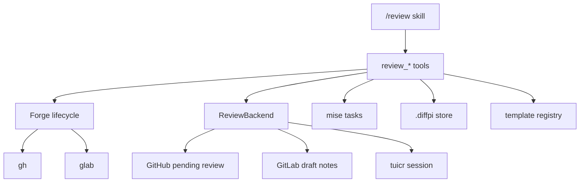

# Review

## Overview

The bundled `/review` skill coordinates GitHub, GitLab, and local `tuicr` reviews. The skill decides what to do. The tools perform deterministic work such as target lookup, diff capture, comment staging, reply storage, publication, and merge checks.

`--local` selects the local `tuicr` working-tree backend. It does not change the pull request lifecycle provider, so `publish --local` can later promote local review work to the current GitHub pull request or GitLab merge request.

## Boundaries

Review support has two independent interfaces.

- `Forge` owns pull request lifecycle operations: create, find, inspect diff and checks, mark ready, close, and merge where supported.
- `ReviewBackend` owns review state: stage comments, read a draft, list threads, reply, resolve, and publish a status.



`createForge` returns the lifecycle adapter. `createRemoteReviewBackend` returns the GitHub or GitLab review adapter. `createLocalReviewBackend` returns the `tuicr` adapter plus the local reply overlay.

## Public tool surface

| Tool                 | Contract                                                                                                                  |
| -------------------- | ------------------------------------------------------------------------------------------------------------------------- |
| `review_context`     | Detect the repository, forge, backend, base branch, environment, shared store, PR/MR, and exact matching `tuicr` session. |
| `review_new`         | Create a new local tuicr review, or require a clean, pushed branch before creating and opening a remote draft PR/MR.      |
| `review_edit`        | Open an existing local tuicr session or an existing remote PR/MR in tuicr without generating comments.                    |
| `review_diff`        | Return the complete forge diff or working-tree diff without the bounded diagnostic-output limit.                          |
| `review_gates`       | Discover real mise tasks and run format, lint, test, commit-subject, and available CI gates.                              |
| `review_submit`      | Write a review artifact and stage comments in the selected backend. Remote comments remain pending.                       |
| `review_add_comment` | Add one incremental comment to the local or remote draft.                                                                 |
| `review_comments`    | Pull remote threads or local comments and write an editable thread artifact.                                              |
| `review_respond`     | Store a reply in the local overlay or post it to a remote thread.                                                         |
| `review_publish`     | Promote local drafts when needed and publish pending work with a selected status. It never merges.                        |
| `review_complete`    | Approve, reject, or abandon a remote review, or archive a local overlay and delete its tuicr session.                     |
| `review_merge`       | Recheck and squash-merge an approved GitHub PR. GitLab merge is intentionally unsupported.                                |
| `review_launch_ui`   | Open `tuicr` in a detected mux, prepare Zed, or return a command.                                                         |

The generic `diffpi_template` tool loads and renders any bundled template or user override.

## Target resolution

A target can be a PR/MR number, URL, branch, or the current branch. Forge adapters return `undefined` only for a confirmed missing PR/MR. Authentication failures, command failures, and malformed JSON remain errors.

`--local` always selects the current working tree. Without it, a target is a PR/MR number, URL, or branch; no target means the current branch. `--bg` is an execution selector: the command removes it before target parsing and launches a tracked background Orchestrator without changing the main chat mode. `auto` creates a review before generating findings. `new` creates a local tuicr review or a remote draft PR/MR. `edit` opens only an existing local session or remote PR/MR. None of these workflows switches branches.

## Workflows

### Auto

`auto` reads the diff, runs gates, and produces line findings plus optional overall issues. Inline execution activates Reviewer on Sol directly. Background execution starts Orchestrator on Luna, which delegates judgment to Reviewer. A working-tree diff includes tracked, staged, and untracked files. Remote findings become a pending forge review. Local findings are written to the matching `tuicr` session. Both paths write a Markdown review record.

Remote comments include the exact active `provider/model` route in a generated-review disclaimer. Local comments use `Agent: <provider/model>` as the `tuicr` author. The review record also stores the route.

### New and edit

`new` creates a local review or a remote draft PR/MR. `edit` opens an existing local or remote review without generating findings. Remote creation requires that the branch is clean, committed, and pushed. `open`, `create`, and `draft` alias `new`; `launch` aliases `auto`.

### Address

`address` activates Reviewer on Sol inline, or routes through a background Orchestrator on Luna. Reviewer pulls every paginated remote thread or local `tuicr` comment into an editable Markdown artifact, classifies the threads, and delegates non-overlapping bounded implementation to lightweight Worker agents. The artifact stores source thread data in a machine-readable payload and keeps replies in a separate bounded section, so Markdown headings in untrusted remote comments cannot alter reply-to-thread mapping. Both address flows can apply requested code changes and answer every question.

A local address flow applies fixes in the current working tree without committing them. It posts question answers to the local `tuicr` session and records them in the artifact for later publication. A remote address flow runs the bundled `/git commit --no-push` workflow after checks pass and before it posts draft responses for changed threads. A question thread stays open after the answer. A non-question remote thread resolves only after its requested change is applied and committed.

### Publish

`publish` accepts `COMMENT`, `APPROVE`, `REQUEST_CHANGES`, or `CLOSE`.

For a local draft, Diffpi reads the exact `tuicr` session, adds provenance, promotes line comments to the remote pending review, posts reply-overlay entries to their remote thread IDs, and publishes the selected status. A stable PR publication state points to the reply overlay even when fixes change the head SHA. Comment and reply fingerprints prevent duplicates after retries or partial failures. For a remote draft, Diffpi publishes the existing pending comments. Neither path posts an overall review comment.

Comment, approve, and request-changes mark a draft PR/MR ready before publication. Close publishes pending work as a comment and then closes the PR/MR. GitLab rejects request-changes because GitLab has no equivalent review state.

### Complete

`complete` is separate from `publish`. For remote reviews it maps approve, reject, and abandon to approve, request-changes, and close lifecycle actions. For local reviews it moves the reply overlay to `.diffpi/reviews/`, then deletes the exact persisted tuicr session. This destructive fallback prevents completed local comments from appearing in tuicr again.

### Merge

Merge is a separate explicit action. `review_publish` and `review_complete` never merge.

`Forge.mergePr` supports GitHub only and calls `assertGitHubMergeReady` immediately before `gh pr merge`. It verifies that the PR is open, is not a draft, has an `APPROVED` decision, has a clean merge state, and has no incomplete or failed checks. The GitLab adapter rejects `mergePr` explicitly. `review_merge` adds the conventional squash subject guard before it calls the adapter.

## Local sessions and reply overlays

A working-tree `tuicr` session matches the canonical repository path and exact branch. A PR session matches the forge repository coordinate and PR/MR number. Stale, malformed, branch-mismatched, and repository-mismatched sessions are ignored.

`tuicr 0.25.0` can show remote threads but cannot reply to or resolve those existing threads. Diffpi therefore stores each remote thread ID and an editable reply field in the Markdown artifact. `review_publish --local` follows the stored overlay path and posts each reply through the remote review backend.

## Storage

Each checkout exposes `.diffpi` as a symlink to:

```text
~/.difflab/diffpi/projects/<repository-name>-<12-character-identity-hash>/
```

The identity hash uses the normalized `origin` remote when available and the canonical Git common directory otherwise. Worktrees for one repository share records. Unrelated repositories with the same basename get different keys.

Active review records and thread overlays live in `.diffpi/review/`; completed local overlays live in `.diffpi/reviews/`:

```text
YYMMDD-<short-head-sha>.md
YYMMDD-uncommitted.md
YYMMDD-<target>-2.md
```

The numeric suffix prevents collisions. `.diffpi/sessions/` stores publication fingerprints and the stable reply-overlay pointer for each forge PR/MR. When the old `.pi/diffpi` path is a symlink to the same shared store, setup removes that legacy link after creating `.diffpi`; unrelated files or links are not removed.

## Template registry

Bundled templates live below the package `templates/` directory. User overrides live below:

```text
~/.difflab/diffpi/templates/
```

The same namespaced path selects both files. For example, `review/draft-pr` resolves to `review/draft-pr.md`. The user file wins when it exists; otherwise Diffpi uses the bundled file. Template variables use `{{name}}` syntax.

## Launcher behavior

The local launcher uses environment variables to detect zellij, tmux, screen, Zed, and the shell. It tries a mux tab first. Without a mux, it prepares the Zed `diffpi: tuicr review` task. In other environments, it returns the exact command for the user to run.

For package development, run `mise watch //packages/pi:dev`. The task builds and installs the package when package sources change. After each successful install, run `/reload` in the active Pi session to load updated extensions and skills; the task never launches Pi.

## JavaScript API

The package root exports forge and review-backend factories and types, review schemas and artifact helpers, gate checks, store helpers, template helpers, `tuicr` helpers, and environment detection. `@difflab/pi/tools` exports `createReviewTools`, `diffpi_template`, and the complete tool catalog.
