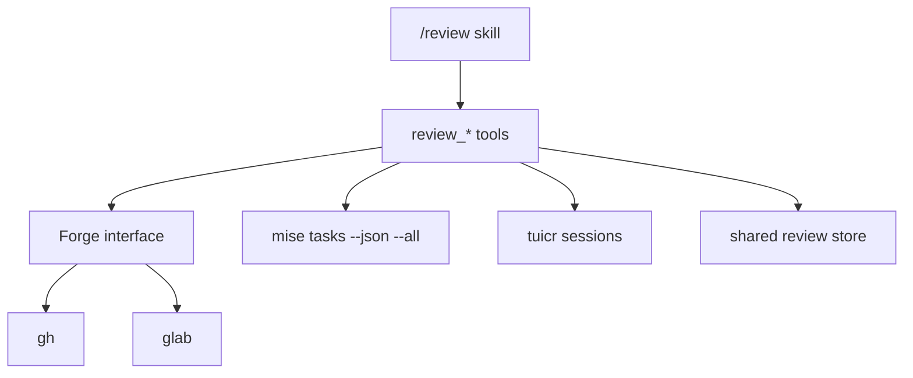

# Review

## Overview

The bundled `/review` skill coordinates GitHub, GitLab, and local `tuicr` review workflows. The skill contains workflow guidance; the `review_*` tools own process execution, forge calls, gate discovery, comment normalization, and durable records.

## Public tool surface

| Tool              | Contract                                                                                                         |
| ----------------- | ---------------------------------------------------------------------------------------------------------------- |
| `review_context`  | Detect the repository, forge, default/base branch, environment, store, PR/MR, and exact matching tuicr session.  |
| `review_open`     | Create a draft PR/MR against the requested or repository default branch, or launch tuicr locally.                |
| `review_diff`     | Return the complete forge diff or local working-tree diff without the bounded diagnostic-output limit.           |
| `review_gates`    | Discover real mise tasks across the monorepo and run format, lint, test, commit-subject, and available CI gates. |
| `review_submit`   | Render a review record and create a pending forge review with review-level and inline comments.                  |
| `review_comments` | Read unresolved comments from the exact repository-and-branch tuicr session.                                     |
| `review_respond`  | Append a local response; remote thread responses use the forge MCP.                                              |
| `review_publish`  | Publish pending comments, preserving the normalized review body, and mark a draft ready.                         |
| `review_complete` | Approve, comment, close, archive, or explicitly reject unsupported review actions. It never merges.              |
| `review_merge`    | Recheck and squash-merge an approved GitHub PR. GitLab merge is intentionally unsupported.                       |
| `review_launch`   | Launch tuicr in the detected mux working directory, configure Zed lazily, or return a command.                   |

`/review open`, `new`, `address`, `publish`, `complete`, and `merge` route to these tools. Forge comment threads remain the forge MCP's responsibility.

## Components



`createForge` returns a provider adapter with draft creation, lookup, default-branch resolution, full diff capture, checks, pending review, submission, ready, and close operations. Operational CLI, authentication, and JSON failures throw; `viewPr` returns `undefined` only for a confirmed missing PR/MR.

GitLab review bodies are draft notes, so a body-only review still creates pending work. GitLab does not expose a GitHub-equivalent `REQUEST_CHANGES` review event; the adapter fails before publishing instead of reporting a false success.

## Merge boundary

`review_complete` never merges. `review_merge` supports GitHub only and checks, immediately before `gh pr merge`, that:

- the PR is open and no longer a draft;
- the review decision is `APPROVED`;
- GitHub reports a clean merge state; and
- every check or status context is complete and successful, skipped, or neutral.

The conventional squash subject guard runs in addition to those readiness checks.

## Storage

Each checkout exposes `.pi/diffpi` as a symlink to:

```text
~/.difflab/diffpi/projects/<repository-name>-<12-character-identity-hash>/
```

The identity hash uses the normalized `origin` remote when available and the canonical Git common directory otherwise. Worktrees for one repository therefore share reviews and sessions, while unrelated repositories with the same basename receive different keys. `reviews/` contains rendered and archived Markdown records; `sessions/` is reserved for local session artifacts.

A tuicr session is selected only when its JSON declares both the exact branch and the canonical repository path. Stale, malformed, branch-mismatched, and repository-mismatched sessions are ignored.

## JavaScript API

The package root exports the review-facing contracts and helpers: `createForge`; forge types; review schemas, rendering, deduplication, and comment conversion; gate checks; store path helpers; tuicr list/read/resolve/normalize/launch helpers; and environment detection. `@difflab/pi/tools` exports `createReviewTools` and the complete tool catalog.
