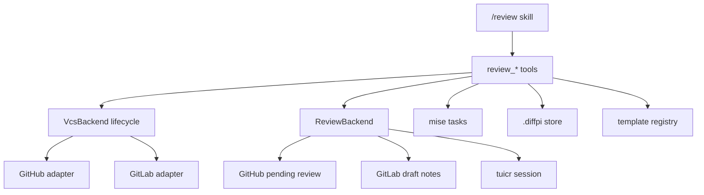

# Review

## Overview

The bundled `/review` skill coordinates GitHub, GitLab, and local `tuicr` reviews. The skill selects a workflow. The `review_*` tools perform deterministic operations such as target lookup, diff capture, comment staging, reply storage, publication, and merge checks.

`--local` selects the local `tuicr` working-tree backend. It does not change the pull request lifecycle provider. A later `publish --local` can promote local review work to the current GitHub pull request or GitLab merge request.

## Requirements

- A remote review requires a supported GitHub or GitLab remote and its CLI (`gh` or `glab`).
- A local review requires `tuicr` on `PATH` and an explicit `--local` or working-tree selection.
- Remote creation requires a clean branch with a configured upstream and all commits pushed.
- Remote comments stay pending until `review_publish`.
- Publish and complete never merge. Merge is a separate GitHub-only action.
- Question replies stay open. Substantive fixes stay open for reviewer confirmation. Only trivial accepted requests resolve automatically.
- Review records must remain stable across worktrees and must not collide across unrelated repositories.

## Design

### Boundaries

Review support has two independent interfaces.

- `VcsBackend` owns pull request lifecycle operations: create, find, inspect diff and checks, mark ready, close, and merge where supported.
- `ReviewBackend` owns review state: stage comments, read a draft, list threads, reply, resolve, and publish a status.



The VCS module keeps the factory, shared types, shared response helpers, and each forge adapter in separate files. CLI process execution stays in `src/extensions/*x.ts`. `createForgeBackend` returns the lifecycle adapter. `createRemoteReviewBackend` returns the GitHub or GitLab review adapter. `createLocalReviewBackend` returns the `tuicr` adapter plus the local reply overlay.

### Target resolution

A target can be a PR/MR number, URL, branch, or the current branch. Forge adapters return `undefined` only for a confirmed missing PR/MR. Authentication failures, command failures, and malformed JSON remain errors.

`--local` always selects the current working tree. Without it, the repository remote must select a supported forge. Diffpi does not silently change an unsupported remote review into a local review. `--bg` removes itself before target parsing and starts a tracked background Orchestrator without changing the main chat mode. No workflow switches branches.

### Local sessions and reply overlays

A working-tree `tuicr` session matches the canonical repository path and exact branch. A PR session matches the forge repository coordinate and PR/MR number. Diffpi ignores stale, malformed, branch-mismatched, and repository-mismatched sessions.

`tuicr 0.25.0` can show remote threads but cannot reply to or resolve existing remote threads. Diffpi stores each remote thread ID and an editable reply field in the Markdown artifact. `review_publish --local` follows that overlay and posts each reply through the remote review backend.

### Storage

Each checkout exposes `.diffpi` as a symlink to:

```text
~/.difflab/diffpi/projects/<repository-name>-<12-character-identity-hash>/
```

The identity hash uses the normalized `origin` remote when available and the canonical Git common directory otherwise. Worktrees for one repository share records. Unrelated repositories with the same basename get different keys.

Active review records and thread overlays live in `.diffpi/review/`. Completed local overlays live in `.diffpi/reviews/`. `.diffpi/sessions/` stores publication fingerprints and the stable reply-overlay pointer for each forge PR/MR.

### Template registry

Bundled templates live below `packages/pi/templates/`. User overrides live below `~/.difflab/diffpi/templates/`. The same namespaced path selects both files, and the user file wins. Draft PR templates include intent, changes, validation, references, and optional further work.

### Launcher behavior

The launcher detects zellij, tmux, screen, Zed, and the shell. It tries a repository-scoped mux tab first. Without a mux, it prepares the Zed `diffpi: tuicr review` task with the exact requested arguments. Other environments receive the exact command to run. Missing `tuicr`, unsupported remotes, and unavailable launch integrations return explicit fallback or error details.

## Implementation

### Public tool surface

| Tool                 | Contract                                                                                                                  |
| -------------------- | ------------------------------------------------------------------------------------------------------------------------- |
| `review_context`     | Detect the repository, forge, backend, base branch, environment, shared store, PR/MR, and exact matching `tuicr` session. |
| `review_new`         | Create a new local tuicr review, or require a clean, pushed branch before creating a remote draft PR/MR.                  |
| `review_edit`        | Open an existing local tuicr session or remote PR/MR without generating comments.                                         |
| `review_diff`        | Return the complete forge diff or working-tree diff without the bounded diagnostic-output limit.                          |
| `review_gates`       | Discover mise tasks and run format, lint, test, commit-subject, and available CI gates.                                   |
| `review_submit`      | Write a review artifact and stage comments in the selected backend.                                                       |
| `review_add_comment` | Add one provenance-marked comment to the local or remote draft.                                                           |
| `review_comments`    | Pull remote threads or local comments and write an editable thread artifact.                                              |
| `review_respond`     | Store a local overlay reply or post a remote thread reply.                                                                |
| `review_publish`     | Promote local drafts when needed and publish pending work with a selected status.                                         |
| `review_complete`    | Approve, reject, or abandon a remote review, or archive a local overlay and delete its tuicr session.                     |
| `review_merge`       | Recheck and squash-merge an approved GitHub PR.                                                                           |
| `review_launch_ui`   | Open `tuicr` in a detected mux, prepare Zed, or return an installation or launch command.                                 |

The generic `diffpi_template` tool loads and renders any bundled template or user override.

### Workflows

#### Auto

`auto` reads the diff, runs gates, and produces line findings plus optional overall issues. Inline execution activates Reviewer on Sol. Background execution starts Orchestrator on Luna, which delegates judgment to Reviewer. A working-tree diff includes tracked, staged, and untracked files. Remote findings become a pending forge review. Local findings enter the matching `tuicr` session. Both paths write a Markdown review record with the active model route.

#### New and edit

`new` creates a local review or remote draft PR/MR. `edit` opens an existing review without generating findings. `open`, `create`, and `draft` alias `new`; `launch` aliases `auto`.

#### Address

`address` pulls every paginated remote thread or local comment into an editable artifact. Reviewer classifies threads and delegates bounded, non-overlapping edits to Worker agents. Local fixes remain uncommitted. Remote fixes pass gates and use the upstream `/git commit --no-push` workflow before replies are posted.

#### Publish

`publish` accepts `COMMENT`, `APPROVE`, `REQUEST_CHANGES`, or `CLOSE`. Local publication adds provenance and promotes review-level, file-level, and line comments. Body, comment, and reply fingerprints prevent duplicates after retries. Comment, approve, and request-changes mark a draft PR/MR ready before publication. Close publishes pending work as a comment and closes the PR/MR. GitLab rejects request-changes because GitLab has no equivalent state.

#### Complete and merge

Remote `complete` maps approve, reject, and abandon to approve, request-changes, and close. Local complete archives the overlay and deletes the exact `tuicr` session. `review_merge` separately checks the conventional subject and calls the GitHub adapter. The adapter rechecks open state, draft state, approval, merge state, and checks immediately before squash merge. GitLab merge is unsupported.

### JavaScript API

The package root exports forge-backend factories and types, review backends, review schemas and artifact helpers, gate checks, store helpers, template helpers, `tuicr` helpers, Zed helpers, and environment detection. `@difflab/pi/tools` exports `createReviewTools`, `diffpi_template`, and the complete tool catalog.

For package development, run `mise watch //packages/pi:dev`. The task builds and installs the package when package sources change. Run `/reload` after each successful install.

## References

- [User guide](../user-guide.md#review)
- [`src/vcs/`](../../packages/pi/src/vcs/)
- [`src/review/`](../../packages/pi/src/review/)
- [`src/tools/review.ts`](../../packages/pi/src/tools/review.ts)
- [`src/extensions/tuicrx.ts`](../../packages/pi/src/extensions/tuicrx.ts)
