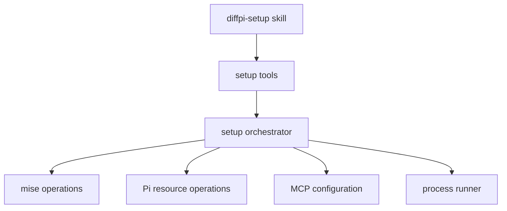

# Setup

## Overview

Setup prepares the user-level Pi environment for Diffpi. It manages command-line tools, Pi resources, agent files, and Model Context Protocol (MCP) servers. Validation reports the same plan without changing the machine.

## Requirements

### Functional

- Validation must report required actions without changing the machine.
- Setup must install missing requirements only after user approval.
- Setup must preserve existing issue-tracker configuration when the user selects none.
- Setup must request a Pi reload when a managed runtime resource changes.
- Agent installation must update package-owned files without deleting unrelated files.
- Zed integration installs stable global review tasks and a pinned plan annotation task.

### Non-Functional

- Repeated setup must not duplicate configuration.
- Public setup tool names must use the `diffpi_` prefix.
- Maintainer-provided skills must be installed from their upstream source.
- File reads must ignore missing optional paths and report other file-system errors.

## Design

### Components



- The `diffpi-setup` skill collects user choices and calls the public tools.
- The setup tools expose validation, mutation, and reload operations.
- The setup orchestrator combines focused mise, Pi, MCP, process, and file-system modules.

### API

#### `diffpi_validate`

Checks the local environment without installing software or changing configuration.

```json
{
  "issueTracker": "none | linear | jira"
}
```

The result lists every requirement with a `ready`, `planned`, or `skipped` status.

#### `diffpi_setup`

Installs missing requirements and updates configuration after the user approves setup.

```json
{
  "issueTracker": "none | linear | jira"
}
```

Linear and Jira are optional. `none` preserves existing issue-tracker configuration.

#### `diffpi_reload`

Queues a runtime reload after setup changes Pi packages, skills, agents, or MCP configuration.

#### `/skill:diffpi-setup`

Collects setup choices with `ask_user_question`, validates when requested, runs approved setup, and reloads Pi when required.

## Implementation

### Shared agent installation

`packages/pi/agents/*.md` is the source of package-managed defaults. Setup installs Tutor, Copilot, Worker, Planner, Reviewer, and Orchestrator as matching `diffpi-*.md` files in `$PI_CODING_AGENT_DIR/agents/`. It leaves other files unchanged. Before writing each profile, setup reads the optional user model order from `~/.difflab/diffpi/config.yaml` or `config.json`, selects the first available authenticated model, and materializes it into the delegated agent's official `model` field. If no preference is available, setup omits `model` so the delegated agent inherits the parent model. See [Agent profiles and inline modes](modes.md) for configuration, discovery, and runtime behavior.

### Managed dependencies

mise installs and updates these command-line tools:

- Node.js 22.19 or newer
- Zellij
- Helix
- tuicr
- Context Mode

Setup also installs Pi packages and upstream skills. It configures Grounded Docs, mise, and Context Mode as MCP servers. The user can add Linear or Jira during setup.

If Zed integration is selected, setup preserves unrelated tasks. It adds two review resolver tasks and one `diffpi: annotate plan` task. The plan task runs `npx --yes @difflab/pi@<installed-version> plan annotate --cwd $ZED_WORKTREE_ROOT`.

### File-system helpers

The `fsx` module reads optional files and directories. It treats `ENOENT` as an absent optional path and reports all other errors to the caller.

## References

- [Pi extension API](https://pi.dev/docs/extensions)
- [Pi packages](https://pi.dev/docs/packages)
- [mise](https://mise.jdx.dev/)
- [pi-mcp-adapter](https://github.com/nicobailon/pi-mcp-adapter)
