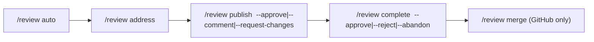

# User Guide

## Requirements

Install pi before `@difflab/pi`. Automatic setup supports macOS and Linux. Shell activation supports Bash, Zsh, Fish, Nushell, Xonsh, Elvish, and PowerShell, with Bash as the fallback.

## Install

```bash
pi install npm:@difflab/pi
```

Run `/skill:diffpi-setup`. The skill collects setup choices, installs missing requirements after approval, and reloads pi when required.

## Validate the environment

Ask pi to validate the local setup. The agent calls `diffpi_validate`, which reports missing software and configuration without changing the machine.

## Set up the environment

Ask pi to set up the local environment or run `/skill:diffpi-setup`. Setup manages mise, Node.js 22.19 or newer, Zellij, Helix, tuicr, Context Mode, structured questions, subagents, inline modes, scheduled prompts, web access, LSP, the MCP adapter, and optional Linear, Jira, GitHub, or GitLab integrations.

## Use shared agents and inline modes

Setup installs shared agents such as `tutor`, `copilot`, `worker`, and `orchestrator`. Use `/mode` for the fast inline picker or `/mode <agent>` for direct selection. Use `/mode clear` or `/mode reset` to restore the previous model, thinking level, tools, and default prompt.

Run `/skill:mode` when skill-agent discovery is needed. Use `--include-skills` to include agents owned by installed skills. Inline modes alter behavior and available tools; they are not a security boundary. Use delegated subagents when work needs a separate session, isolation, or nested delegation.

## Plan work

A durable plan is an editable `PLAN.md` file with stable machine markers. Diffpi stores each plan, its append-only `logs.txt` file, and one editable implementation brief per phase under `.diffpi/plan/<YYMMDD[-ticket]-short-slug>/`. Phase briefs use `implementation/phase-<phase-id>.md` and the bundled implementation template.

Create an empty draft when you want to write comments first:

```text
/plan init eng-123-api-cache --branch feature/cache
/plan annotate eng-123-api-cache
/plan update eng-123-api-cache
```

Create a populated plan from a prompt or the current conversation:

```text
/plan new eng-123-api-cache add cache invalidation to the API
/plan new eng-123-api-cache --bg add cache invalidation to the API
/plan update eng-123-api-cache tighten the rollback criteria
/plan update eng-123-api-cache --bg apply all unambiguous comments
```

Background authoring uses a bounded context packet with mode `0600`. Conversation text does not appear in process arguments. A background agent records assumptions and stops on unresolved product decisions. It does not ask questions.

Annotate the file with `tuicr --file`. Do not use `-p` or `--path` because those flags filter a VCS diff.

```text
/plan annotate eng-123-api-cache
npx --yes @difflab/pi@<version> plan annotate eng-123-api-cache --cwd "$PWD"
diffpi plan annotations eng-123-api-cache --cwd "$PWD"
```

Run `/plan update` after annotation. The workflow reads pending comments first, applies valid changes, validates the plan, and acknowledges applied comment IDs. A failed or partial update leaves the other comments pending.

Finalize and run the plan:

```text
/plan finalize eng-123-api-cache
/plan go eng-123-api-cache --no-commit
/plan go eng-123-api-cache --commit --bg
/plan help
```

Finalize requires phases, tasks, acceptance criteria, valid dependencies, no pending comments, and a Design section of 800 words or fewer. Design warnings start above 300 words. The `--branch` flag records or filters a branch. It does not create or switch the branch.

Inline execution selects Worker. Background execution selects Orchestrator but keeps the current foreground mode. Each phase runs the available mise `format:check`, `lint`, and `test` tasks. A missing recipe is recorded as skipped. A warning or failure blocks completion.

`--no-commit` does not create commits. `--commit` requires a clean starting worktree and creates one conventional local commit after each phase passes its gates. Phase commits use `/git commit --yes --no-push`, so the workflow never pushes.

A worker records blockers and evidence in the plan. Planner can revise pending or blocked work two times in a background run. If work needs a user decision, run `/plan update <slug>` and then run `/plan go <slug>` with the prior commit policy.

A crash can occur after Git creates a commit but before the plan records its SHA. Compare `HEAD` with `logs.txt`, then record the existing commit before you resume.

Override the plan template at `~/.difflab/diffpi/templates/plan/PLAN.md`. Zed setup installs the `diffpi: annotate plan` task, which runs a pinned package CLI from `$ZED_WORKTREE_ROOT`.

## Review

`/review` supports local `tuicr` reviews and forge-native GitHub or GitLab reviews. Use `--local` for the current working tree; without it, the repository remote selects the forge. `--bg` runs the workflow in a tracked background orchestrator.

### Local tuicr review


Local reviews inspect the whole current branch: committed branch changes plus uncommitted changes, using `tuicr -w -r <base>..HEAD`. The base is the PR base when known or the supported forge default branch; local launch fails if neither is available. `auto` reviews tracked, staged, and untracked changes. `address` applies fixes without committing. `publish` promotes comments to the forge when desired; `complete` archives the local review. Local review records use `.diffpi/review/` and completion archives to `.diffpi/reviews/`.

### Forge-native GitHub/GitLab review



`/review edit` opens an existing local or remote tuicr session. Comments made in a remote PR session remain local drafts until `/review publish --local` promotes them to the forge. In a remote PR session, a draft on the same file and line as an existing thread becomes a reply; prefix it with `[REOPEN]` or `[RESOLVE]` to control the thread state. Other drafts are published as new comments. The publish workflow also handles a local working-tree session. Review publication does not merge; use `/review merge` separately.

## Configuration notes

Setup installs shared agents into `$PI_CODING_AGENT_DIR/agents/` and reads ordered model preferences from `~/.difflab/diffpi/config.yaml` or `config.json`. YAML takes precedence. Run `/skill:diffpi-setup` after changing the configuration so delegated profiles are rematerialized.

Linear and Jira remain optional. Select one during setup and complete its OAuth login from the MCP adapter afterward. Selecting none preserves existing issue-tracker configuration.
